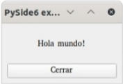

# holamundo-pyside6

Hola mundo con PySide6.

Para ejecutar el _hola mundo_, necesitamos instalar antes Python 3 y sus dependencias.

---

## Clonamos el proyecto en local y entramos en la carpeta del proyecto

```sh
$ git clone https://github.com/di-mcgrawhill/holamundo-pyside6.git
$ cd holamundo-pyside6/
```

---

## Instalación de Python3


### Linux

Python3 viene preinstalado en la mayoría de distribuciones Linux, se puede comprobar si está instalado ejecutando la siguiente orden en una terminal:

```sh
$ python3 --version
```

De no estar instalado, se puede descargar desde [aquí](https://www.python.org/downloads/).

Para más información de cómo instalar, consultar la [documentación](https://docs.python.org/3/using/unix.html).

### Windows

Descargar el instalador haciendo clic [aquí](https://www.python.org/downloads/windows/) y seguir las instrucciones en pantalla.

Se dispone de más información sobre su instalación en el siguiente [enlace](https://docs.python.org/3/using/windows.html).

### macOS

Se dispone del binario ejecutable en el siguiente [enlace](https://www.python.org/downloads/macos/).

Se dispone de más información sobre su instalación en el siguiente [enlace](https://docs.python.org/3/using/mac.html).

---

## Creación de un entorno virtual (venv)

Para crear un entorno virtual y poder aislar la ejecución del resto del sistema (_sandbox_), ejecutamos la siguiente instrucción en una terminal:

```sh
$ python3 -m venv venv
```

---

## Activación del entorno virtual

### Linux y macOS

```sh
$ source venv/bin/activate
```

### Windows

```sh
$ venv\Scripts\activate.bat
```

---

## Instalación de dependencias

```sh
$ pip install -r requirements.txt
```

---

## Ejecución

```sh
$ python3 src/holamundo_pyside6/holamundo.py
```

Nos mostrará la aplicación **holamundo_pyside6** en ejecución:


